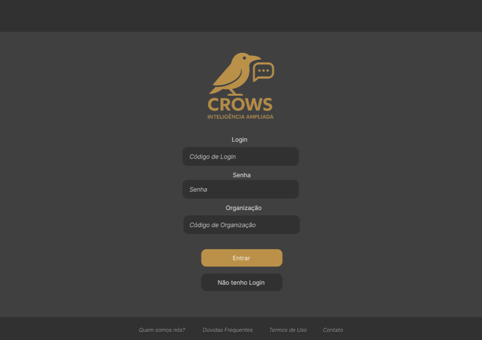
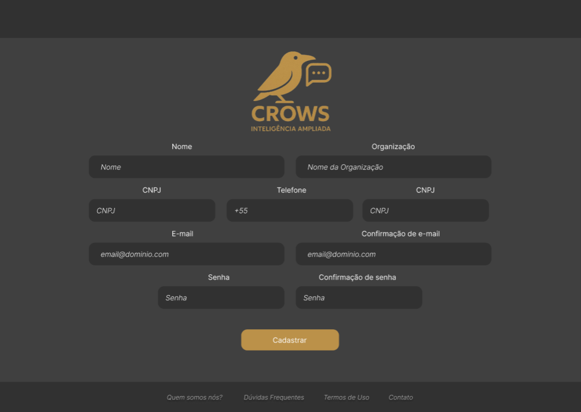
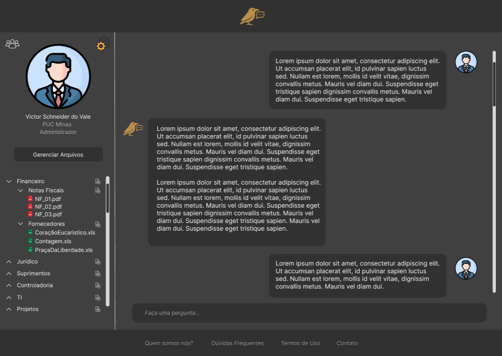
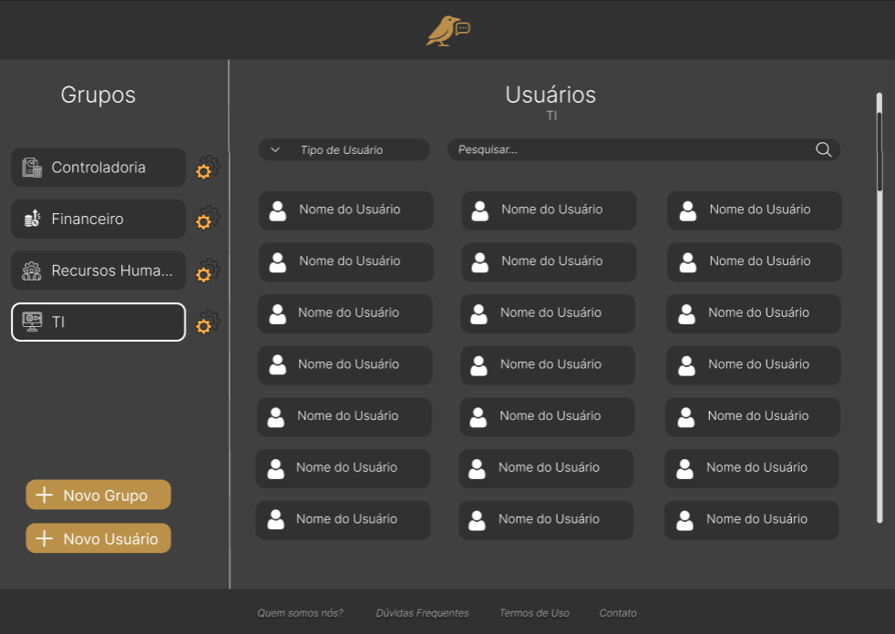
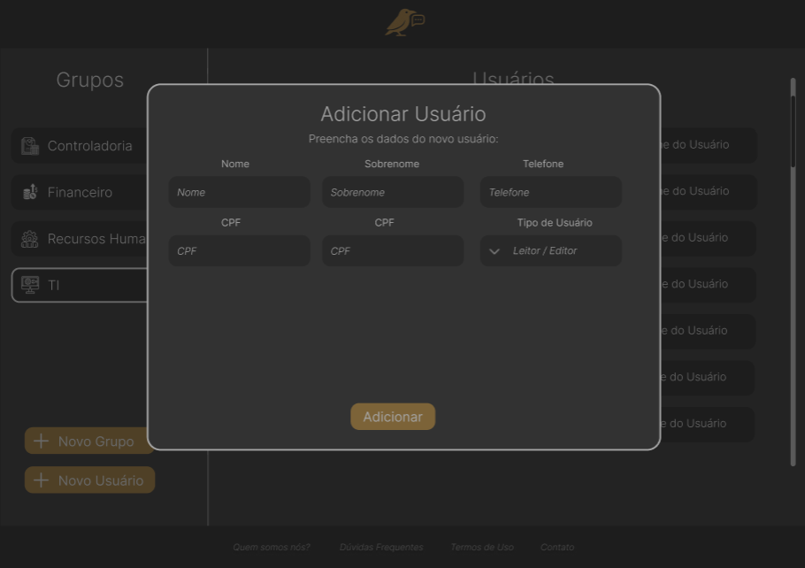
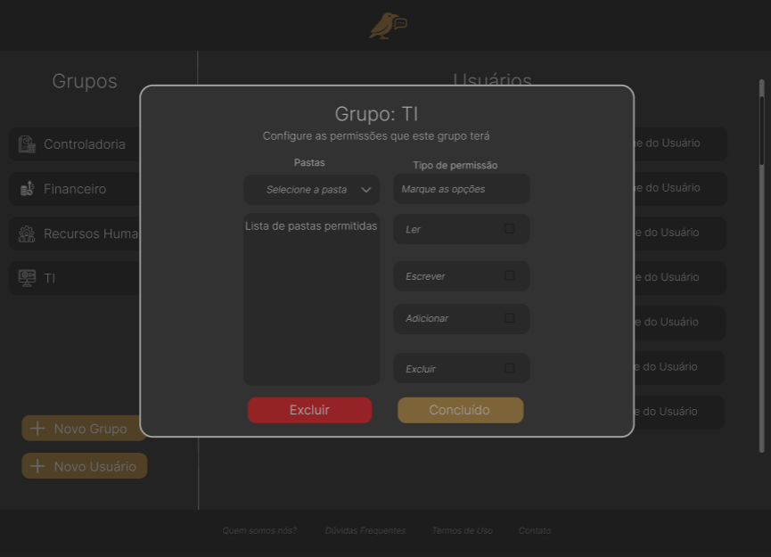

# Projeto de interface

Pré-requisitos: <a href="02-Especificacao.md"> Especificação do projeto</a>

Visão geral da interação do usuário pelas telas do sistema e protótipo interativo das telas com as funcionalidades que fazem parte do sistema (wireframes).

 Apresente as principais interfaces da plataforma. Discuta como ela foi elaborada de forma a atender os requisitos funcionais, não funcionais e histórias de usuário abordados na <a href="02-Especificacao.md"> Especificação do projeto</a>.

 ## User flow

A imagem a seguir representa o fluxo de navegação do usuário dentro do sistema, destacando as etapas, decisões e ações que podem ser realizadas desde o momento do cadastro até a utilização efetiva da aplicação.

<!-- > **Links úteis**:
> - [User flow: o quê é e como fazer?](https://medium.com/7bits/fluxo-de-usu%C3%A1rio-user-flow-o-que-%C3%A9-como-fazer-79d965872534)
> - [User flow vs site maps](http://designr.com.br/sitemap-e-user-flow-quais-as-diferencas-e-quando-usar-cada-um/)
> - [Top 25 user flow tools & templates for smooth](https://www.mockplus.com/blog/post/user-flow-tools) -->

### Diagrama de fluxo

Os seguinte diagrama ilustra como será o fluxo a ser seguido por usuários na aplicação, sendo esse fluxo contínuo e de fácil entendimento.

<!-- > **Links úteis**:
> - [Como criar um diagrama de fluxo de usuário](https://www.lucidchart.com/blog/how-to-make-a-user-flow-diagram)
> - [Fluxograma online: seis sites para fazer gráfico sem instalar nada](https://www.techtudo.com.br/listas/2019/03/fluxograma-online-seis-sites-para-fazer-grafico-sem-instalar-nada.ghtml) -->

## Interface do sistema

As imagens a seguir representam os projetos de interface do sistema, onde definimos o design e o posicionamento das funcionalidades da Crows IA.

### Login
A página de Login, onde o usuário pode se autenticar

### Cadastro
Página onde usuários não registrados poderão criar suas credenciais

### Home
Página inicial do sistema, que conta com algumas informações do usuário, um breve resumo dos arquivos disponíveis para esse usuário acessar e um campo de ChatBot com a IA da plataforma

### Usuários
Nessa página, os admnistradores de organizações poderão gerenciar seus usuários, podendo visualizar, mover, adicionar, remover, entre outras ações envolvendo os usuários

### Adicionar Usuários
Nessa página, os admnistradores de organizações poderão visualizar um modal no qual será possível preencher o cadastro de um novo usuário

### Edição de Grupos
Página onde os admnistradores de organizações poderão gerenciar seus grupos de usuários, podendo visualizar, mover, adicionar, remover, entre outras ações envolvendo os grupos

> Apresente as principais interfaces da plataforma em sua versão final.
