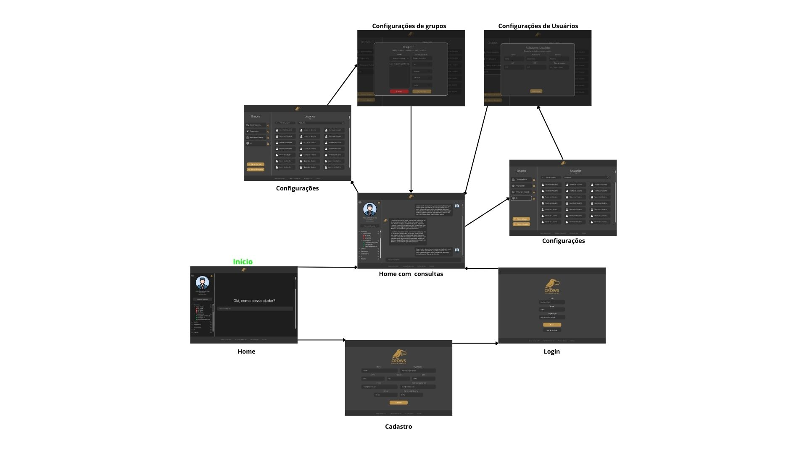
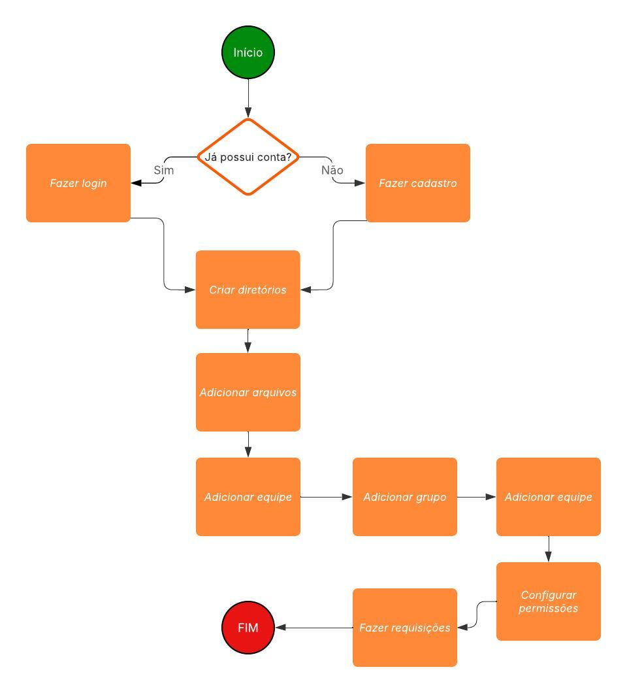

# Projeto de interface

Pré-requisitos: <a href="02-Especificacao.md"> Especificação do projeto</a>

Visão geral da interação do usuário pelas telas do sistema e protótipo interativo das telas com as funcionalidades que fazem parte do sistema (wireframes).

 Apresente as principais interfaces da plataforma. Discuta como ela foi elaborada de forma a atender os requisitos funcionais, não funcionais e histórias de usuário abordados na <a href="02-Especificacao.md"> Especificação do projeto</a>.

 ## User flow

A imagem a seguir representa o fluxo de navegação do usuário dentro do sistema, destacando as etapas, decisões e ações que podem ser realizadas desde o momento do cadastro até a utilização efetiva da aplicação.

<!-- > **Links úteis**:
> - [User flow: o quê é e como fazer?](https://medium.com/7bits/fluxo-de-usu%C3%A1rio-user-flow-o-que-%C3%A9-como-fazer-79d965872534)
> - [User flow vs site maps](http://designr.com.br/sitemap-e-user-flow-quais-as-diferencas-e-quando-usar-cada-um/)
> - [Top 25 user flow tools & templates for smooth](https://www.mockplus.com/blog/post/user-flow-tools) -->

### Diagrama de fluxo

Os seguinte diagrama ilustra como será o fluxo a ser seguido por usuários na aplicação, sendo esse fluxo contínuo e de fácil entendimento.

<!-- > **Links úteis**:
> - [Como criar um diagrama de fluxo de usuário](https://www.lucidchart.com/blog/how-to-make-a-user-flow-diagram)
> - [Fluxograma online: seis sites para fazer gráfico sem instalar nada](https://www.techtudo.com.br/listas/2019/03/fluxograma-online-seis-sites-para-fazer-grafico-sem-instalar-nada.ghtml) -->

## Wireframes

São protótipos usados no design de interface para sugerir a estrutura de um site web e seu relacionamento entre suas páginas. Um wireframe web é uma ilustração que mostra o layout dos elementos fundamentais na interface.

 
> **Links úteis**:
> - [Protótipos: baixa, média ou alta fidelidade?](https://medium.com/ladies-that-ux-br/prot%C3%B3tipos-baixa-m%C3%A9dia-ou-alta-fidelidade-71d897559135)
> - [Protótipos vs wireframes](https://www.nngroup.com/videos/prototypes-vs-wireframes-ux-projects/)
> - [Ferramentas de wireframes](https://rockcontent.com/blog/wireframes/)
> - [MarvelApp](https://marvelapp.com/developers/documentation/tutorials/)
> - [Figma](https://www.figma.com/)
> - [Adobe XD](https://www.adobe.com/br/products/xd.html#scroll)
> - [Axure](https://www.axure.com/edu) (Licença Educacional)
> - [InvisionApp](https://www.invisionapp.com/) (Licença Educacional)

## Interface do sistema

Visão geral da interação do usuário por meio das telas do sistema. 

> Apresente as principais interfaces da plataforma em sua versão final.
