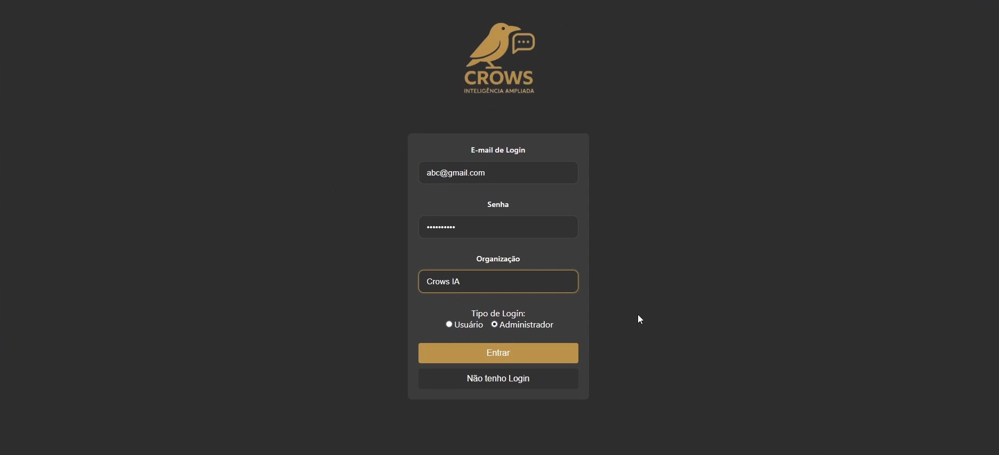
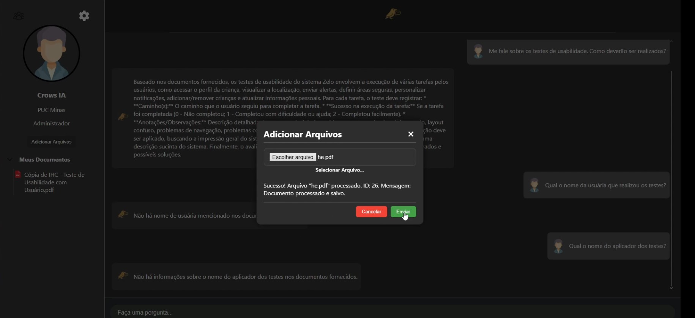
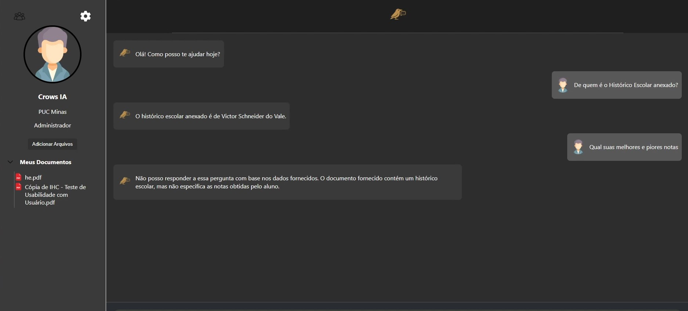

# **Registro de Execução de Testes de Software – CrowsIA**

Este documento detalha os resultados da execução dos testes definidos no Plano de Testes da plataforma **CrowsIA**, com base nos cenários funcionais e não funcionais planejados.

---

## **Informações Gerais do Ciclo de Teste**

 ***Crows Inteligência Ampliada***  
- **Data de Execução:** 23/06/2025  
- **Responsável pela Execução:** Igor Maia, Victor Schneider 

---

## **1. Resumo dos Resultados**

- **Total de Casos de Teste Executados:** 12   
- **Status Geral do Ciclo:**  **Aprovado**  
  > *Todos os testes foram concluídos com sucesso, sem incidentes críticos.*

## 🔍 **2. Resultados Detalhados dos Testes Funcionais**

### 2.1 Cadastro e Login de Usuário

| ID do Teste | Descrição                     | Resultado Esperado                             | Resultado Obtido             | Status     | Observações                                       |
|-------------|-------------------------------|------------------------------------------------|------------------------------|------------|--------------------------------------------------|
| CT01        | Cadastro de novo usuário      | Cadastro realizado com sucesso                 | Obtido com sucesso           | Aprovado   | Teste realizado com diferentes domínios de e-mail |
| CT02        | Login com dados corretos      | Redirecionamento para tela do Chat             | Obtido com sucesso           | Aprovado   | -                                                |
| CT03        | Login com senha incorreta     | Mensagem de erro exibida                       | Obtido com sucesso           | Aprovado   | Validação realizada após 3 tentativas erradas    |
| CT04        | E-mail inválido no cadastro   | Bloqueio por formato inválido                  | Obtido com sucesso           | Aprovado   | Verificado com diferentes padrões inválidos       |

📁 **Evidências:** 

---

### 2.2 Cadastrando Documentos

| ID do Teste | Descrição                      | Resultado Esperado                        | Resultado Obtido   | Status     | Observações                                 |
|-------------|--------------------------------|-------------------------------------------|--------------------|------------|----------------------------------------------|
| CT05        | Cadastro de documento          | Documento salvo com sucesso               | Obtido com sucesso | Aprovado   | Testado com arquivos .pdf e .docx            |
| CT06        | Usuário não logado             | Acesso bloqueado                          | Obtido com sucesso | Aprovado   | Sistema redireciona corretamente ao login    |

📁 **Evidências:** 

---

### 2.3 Interação com o Chatbot

| ID do Teste | Descrição                                      | Resultado Esperado                                       | Resultado Obtido   | Status     | Observações                                    |
|-------------|------------------------------------------------|----------------------------------------------------------|--------------------|------------|------------------------------------------------|
| CT07        | Resposta do chatbot com um documento enviado   | Resposta coerente com o conteúdo                         | Obtido com sucesso | Aprovado   | -                                              |
| CT08        | Resposta com múltiplos documentos cadastrados  | Resposta integrada e adequada com as fontes envolvidas   | Obtido com sucesso | Aprovado   | IA priorizou os documentos mais recentes       |

📁 **Evidências:**

---

## **3. Resultados dos Testes Não Funcionais**

### 3.1 Usabilidade

| ID do Teste | Descrição                    | Resultado Esperado                            | Resultado Obtido     | Status     | Observações                              |
|-------------|------------------------------|-----------------------------------------------|----------------------|------------|-------------------------------------------|
| NF01        | Interface intuitiva          | Usuário navega sem necessidade de instruções  | Constatado           | Aprovado   | Testadores conseguiram operar sem tutoria |
| NF02        | Feedback visual               | Mensagens e indicadores exibidos corretamente | Adequado             | Aprovado   | Ícones de carregamento foram eficazes     |

---

### 3.2 Desempenho

| ID do Teste | Descrição                   | Resultado Esperado           | Resultado Obtido | Status     | Observações                          |
|-------------|-----------------------------|------------------------------|------------------|------------|---------------------------------------|
| NF03        | Tempo de carregamento       | Sistema responde em até 3s   | 1.8s             | Aprovado   | Teste feito em rede Wi-Fi doméstica   |

---

### 3.3 Segurança

| ID do Teste | Descrição                               | Resultado Esperado                                     | Resultado Obtido   | Status     | Observações                                        |
|-------------|------------------------------------------|--------------------------------------------------------|--------------------|------------|---------------------------------------------------|
| NF04        | Armazenamento seguro de senhas           | Senhas criptografadas no banco                         | Verificado         | Aprovado   | Confirmado com visualização direta do banco       |
| NF05        | Tempo de resposta da IA < 6 segundos     | IA responde dentro do tempo esperado                   | Média de 4s        | Aprovado   | Testes repetidos em horários diferentes           |

---

## **4. Incidentes Registrados**

Nenhum incidente registrado durante a execução do ciclo de testes.

---

## **5. Conclusão e Recomendações**

A aplicação **CrowsIA** apresentou desempenho satisfatório em todos os testes previstos, validando sua prontidão para implantação. Todos os critérios de aceitação foram atendidos sem ocorrências de falhas funcionais ou de segurança.

**Recomendações Finais:**
- Seguir com o processo de homologação.
- Incluir testes automatizados para futuras iterações.
- Monitorar tempo de resposta da IA com múltiplas fontes documentais em uso intensivo.

---

## 🧾 **6. Algumas Avaliações de Individuos Convidados**

### Andry Marques

| Funcionalidade | Resultado | Observações                    |
|----------------|-----------|--------------------------------|
| Cadastro       | Sucesso   | Fluxo intuitivo e rápido       |
| Login          | Sucesso   | Entrou corretamente            |
| Upload Docs    | Sucesso   | Feedback visual claro          |
| Chat           | Sucesso   | Boa interpretação das perguntas|

---

### Kauan Maia Moreira Fernandes

| Funcionalidade | Resultado | Observações                           |
|----------------|-----------|----------------------------------------|
| Cadastro       | Sucesso   | Preenchimento simples                 |
| Login          | Sucesso   | Redirecionamento correto              |
| Upload Docs    | Sucesso   | Layout dark e simples                 |
| Chat           | Sucesso   | IA entendeu perguntas sobre arquivo grande |

---

### Pablo Marques

| Funcionalidade | Resultado | Observações                         |
|----------------|-----------|--------------------------------------|
| Cadastro       | Sucesso   | -                                    |
| Login          | Sucesso   | Login rápido                         |
| Upload Docs    | Sucesso   | Documento aceito sem erros           |
| Chat           | Sucesso   | Resposta direta, muito legal         |

---
